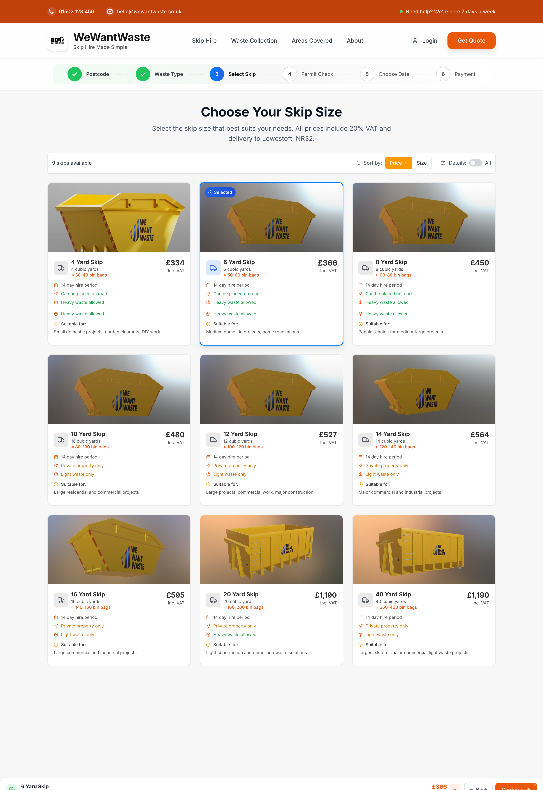
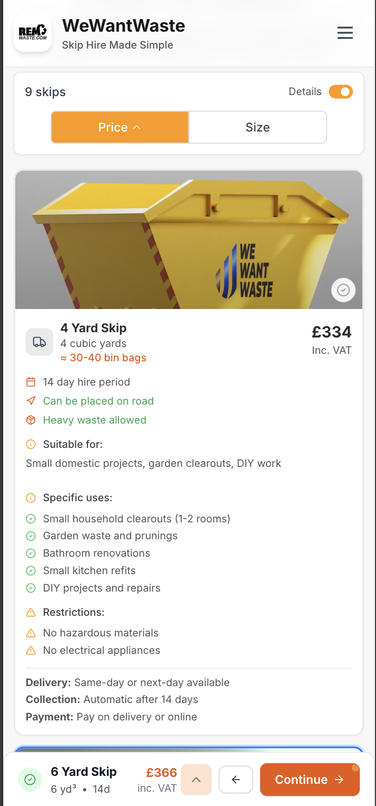
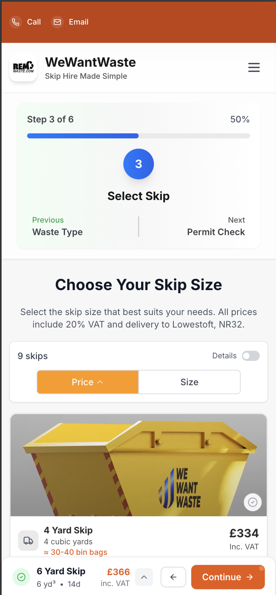
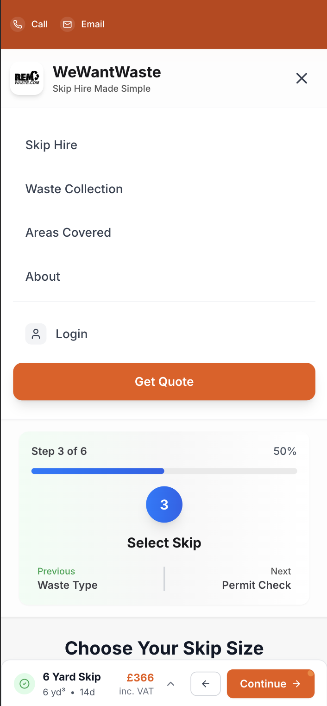
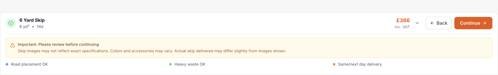

# WeWantWaste - Skip Selection Page Redesign

A complete redesign of the "Choose Your Skip Size" page for WeWantWaste, completed as a front-end coding challenge. This project transforms a basic selection interface into a modern, responsive, and user-centric booking experience while maintaining all core functionality.

---

## 🚀 **Live Demo**

**[View the live, interactive demo here →](https://skip-leewel-karanis-projects.vercel.app/)**

*Experience the fully responsive design with functional sorting, detailed skip information, and smooth animations*

---

## 📸 **Visual Showcase**

### **Final Design - Desktop View**

*The completed interface showcasing the modern card-based layout with comprehensive skip information and intuitive user experience*

### **Mobile Responsive Design**
<div style="display: flex; gap: 10px; flex-wrap: wrap;">
  
  
  
  
</div>

*Mobile-first responsive design optimized for touch interactions and smaller screens*

### **Enhanced User Experience Features**

*Smart floating footer with contextual information and seamless user guidance*


*Comprehensive skip details with progressive disclosure and clear pricing transparency*

### **Design Evolution & Thought Process**

*Initial blue-themed design exploration - This early iteration helped establish the card-based layout and interaction patterns before evolving to the final brand-aligned orange and professional color scheme that better represents WeWantWaste's identity*

---

## 🎯 **My Approach & Design Philosophy**

My primary goal was to transform the user experience from a basic selection list into a clean, intuitive, and professional booking interface. I focused on three core areas:

### **1. UI/UX & Visual Design**

* **Modern Aesthetics:** I replaced the dated layout with a clean, card-based grid system using shadowing, rounded corners, and proper spacing. This provides better visual separation for each option and makes the page easier to scan.

* **Brand-Aligned Color Evolution:** I began with a blue-themed design exploration (shown in submission images) to establish interaction patterns and layout structure. After analyzing WeWantWaste's brand identity, I evolved to a sophisticated color system that better represents their business:
    * **Primary Orange (`#FF9900`):** Reserved for key calls-to-action (`Continue`, `Get Quote`) to guide users and improve conversion
    * **Accent Blue (`#007BFF`):** Used exclusively for selection states to provide clear, unambiguous feedback without competing with primary actions
    * **Professional Neutrals:** Clean greys and whites create a professional backdrop that improves readability and reduces visual clutter

* **Interactive Feedback:** The UI provides clear visual feedback through:
    - Prominent selection borders with accent colors
    - Smooth hover effects and micro-animations using Framer Motion
    - Visual sorting indicators for price and size
    - Smart continue button behavior that appears when a selection is made

### **2. Enhanced User Experience**

* **Intuitive Skip Selection:** Each skip card displays comprehensive information including:
    - Clear size specifications and equivalent bin bag counts
    - Detailed use case descriptions (e.g., "Small domestic clearouts", "Kitchen renovations")
    - Pricing transparency with VAT inclusion
    - Visual restrictions and capabilities

* **Smart Functionality:** 
    - **Functional Sorting:** Users can sort by price or size with visual toggle indicators
    - **Auto-selection:** The recommended 6-yard skip is pre-selected for faster decision-making
    - **Expandable Details:** Collapsible sections reveal additional information without overwhelming the initial view
    - **Progressive Disclosure:** Users can access detailed information on demand without cluttering the interface

* **Contextual Guidance:** Smart floating footer provides contextual information and disclaimers exactly when users need them.

### **3. Technical Excellence & Responsiveness**

* **Mobile-First Design:** 
    - **Desktop:** Multi-column grid effectively utilizes available space
    - **Tablet:** Responsive grid that adapts to medium screens
    - **Mobile:** Single-column layout optimized for touch interactions (see mobile screenshots)

* **Production-Ready Code:**
    - **Component Architecture:** Clean, reusable React components with TypeScript
    - **Performance Optimized:** Uses React.memo, useMemo, and useCallback for optimal rendering
    - **Error Handling:** Comprehensive error boundaries and loading states
    - **Accessibility:** WCAG-compliant with proper ARIA attributes and keyboard navigation
    - **Performance Monitoring:** Integrated Vercel Speed Insights for real-time performance tracking

---

## 🛠 **Tech Stack**

* **React 19** - Latest stable version with modern hooks and concurrent features
* **TypeScript** - Type safety and enhanced developer experience
* **Tailwind CSS** - Utility-first CSS framework for rapid, maintainable styling
* **Framer Motion** - Smooth animations and micro-interactions
* **Lucide React** - Modern, consistent icon library
* **Axios** - HTTP client for API integration
* **React Scripts** - Zero-config build setup
* **Vercel Speed Insights** - Performance monitoring and optimization

---

## 🚀 **Getting Started**

### **Prerequisites:**
- Node.js (v16 or later recommended)
- npm or yarn

### **Installation:**

1. **Clone the repository:**
```bash
git clone https://github.com/Siffersari/Skip.git
cd skip-redesign
```

2. **Install dependencies:**
```bash
npm install
```

3. **Start the development server:**
```bash
npm start
```

The application will be running at `http://localhost:3000`

### **Build for production:**
```bash
npm run build
```

---

## 📁 **Project Structure**

```
src/
├── components/
│   ├── SkipCard.tsx          # Main skip selection card component
│   ├── Header.tsx            # Application header with branding
│   ├── Stepper.tsx          # Progress indicator component
│   ├── FilterSort.tsx       # Sorting and filtering controls
│   └── FloatingFooter.tsx   # Bottom action bar with contextual info
├── pages/
│   └── SkipSelectionPage.tsx # Main page component
├── layouts/
│   └── MainLayout.tsx       # Primary layout wrapper
├── hooks/
│   └── useSkips.ts          # Custom hook for skip data management
├── services/
│   └── api.ts               # API integration and data fetching
├── types/
│   └── index.ts             # TypeScript type definitions
├── utils/
│   └── index.ts             # Utility functions (formatting, etc.)
└── constants/
    └── index.ts             # Application constants
```

---

## ✨ **Key Features Implemented**

### **Core Functionality:**
- ✅ **Skip Selection:** Interactive grid with detailed skip information
- ✅ **API Integration:** Real-time data from WeWantWaste API endpoints
- ✅ **Sorting:** Functional price and size sorting with visual indicators
- ✅ **Responsive Design:** Optimized for all device sizes
- ✅ **Auto-selection:** Pre-selects recommended 6-yard skip

### **User Experience Enhancements:**
- ✅ **Loading States:** Professional loading indicators during API calls
- ✅ **Error Handling:** User-friendly error messages and retry functionality
- ✅ **Smooth Animations:** Micro-interactions that enhance usability
- ✅ **Accessibility:** Keyboard navigation and screen reader support
- ✅ **Progressive Disclosure:** Expandable details for comprehensive information
- ✅ **Contextual Information:** Smart floating footer with guidance and disclaimers

### **Technical Excellence:**
- ✅ **TypeScript:** Full type safety across the application
- ✅ **Performance Optimization:** Memoization and efficient re-rendering
- ✅ **Performance Monitoring:** Vercel Speed Insights integration
- ✅ **Clean Code:** Maintainable, documented, and well-structured
- ✅ **Modern React:** Hooks, functional components, and best practices

---

## 🎨 **Design Decisions**

### **Color Strategy:**
- **Orange (`#FF9900`):** Primary actions and brand consistency
- **Blue (`#007BFF`):** Selection states and interactive elements
- **Greys:** Content hierarchy and professional appearance

### **Typography:**
- Clear hierarchy with consistent font weights
- Optimized for readability across all device sizes
- Proper contrast ratios for accessibility compliance

### **Layout Philosophy:**
- **Card-based design** for clear content separation
- **Grid system** that adapts fluidly to screen sizes
- **White space** strategically used to reduce cognitive load

---

## 🔄 **Future Improvements**

Given additional time, I would consider implementing:

* **Interactive Skip Recommendation Quiz:** A guided questionnaire to help users determine the perfect skip size based on their specific project requirements, waste type, and timeline
* **Advanced Filtering & Search:** Enable users to filter skips by specific criteria including:
  - Location restrictions (road placement vs. private property)
  - Waste type compatibility (heavy materials, mixed waste, etc.)
  - Delivery timeline preferences
  - Price range filters
* **3D Skip Visualization:** 
  - Interactive 3D models showing accurate skip dimensions
  - Benefits: Helps users better understand size relationships and spatial requirements
  - Scale comparison with common objects (cars, garden sheds, etc.)
* **AR/VR Integration:** 
  - Augmented Reality skip placement preview in user's actual location
  - Virtual Reality skip size comparison experience
  - Benefits: Reduces booking uncertainty and returns, improves customer satisfaction
* **Enhanced Details on Demand:** 
  - Expandable sections for technical specifications
  - Photo galleries showing real skip placements
  - Customer review integration
* **Comparison Tool:** Side-by-side skip comparison functionality
* **User Preferences:** Remember previous selections and preferences
* **Advanced Analytics:** User interaction tracking for conversion optimization
* **Unit Testing:** Comprehensive test coverage using Jest and React Testing Library

---

## ⚡ **Performance Insights**

The application is optimized for performance with Vercel Speed Insights integration:

```javascript
import { SpeedInsights } from "@vercel/speed-insights/react"
```

This provides real-time performance monitoring including:
- Core Web Vitals tracking
- User experience metrics
- Performance optimization suggestions
- Real user monitoring data

---

## 📋 **API Integration**

The application integrates with the WeWantWaste API:

- **Endpoint:** `https://app.wewantwaste.co.uk/api/skips/by-location`
- **Parameters:** `postcode=CB42UU&area=docking`
- **Response:** Array of skip objects with pricing, specifications, and availability

Error handling includes retry logic and fallback data to ensure a smooth user experience even when the API is unavailable.

---

## 🏆 **Project Highlights**

This redesign demonstrates:

1. **User-Centric Design:** Every decision prioritizes user experience and conversion
2. **Technical Proficiency:** Modern React patterns, TypeScript, and performance optimization
3. **Production Readiness:** Error handling, accessibility, and maintainable code structure
4. **Brand Alignment:** Respects existing brand identity while modernizing the interface
5. **Business Value:** Improved usability that should lead to higher conversion rates
6. **Design Evolution:** Thoughtful progression from initial concepts to final brand-aligned solution

---

**Completed by:** Leewel Karani  
**GitHub Repository:** [https://github.com/Siffersari/Skip](https://github.com/Siffersari/Skip)  
**Live Demo:** [https://skip-leewel-karanis-projects.vercel.app/](https://skip-leewel-karanis-projects.vercel.app/)
